<h1>The Bible and History</h1>

The Bible and History is a website where you can find historical topics of Bible in it's cultural background. here you will find archealogial findings also regarding same topic. the topic will also contain it's idiomatic sens, religiouse background, tranditional background, liguastic approach, mythical prospective, pictures and if needed you will also find video/audio discussion also.

Welcome to a small trip of The Bible and Hisotry.

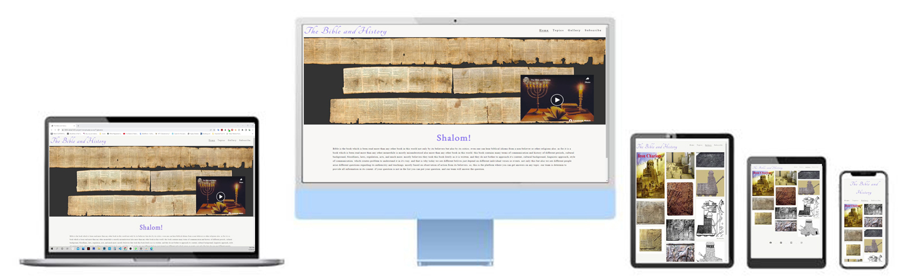

<h2>Contents</h2>

<hr4>Features</hr4>
<ul>Home
<li>Navigation Menu</li>
<li>Gallery</li>
<li>Topics</li>
<li>Subscribe</li>
</ul>
<ul>Topics
<li>Iron Chariots</li>
more are coming soon!
</ul>Gallery
<li>Iron Chariots</li>
<ul>
<ul>Subscribe
<li>Subscribe here</li>
</ul>
<ul>Footer
</ul>

<h2>Wireframes</h2>

There are frames for a full width display and a small mobile device. The final site varies slightly from the wireframes due to developments that occured during the creation process. 

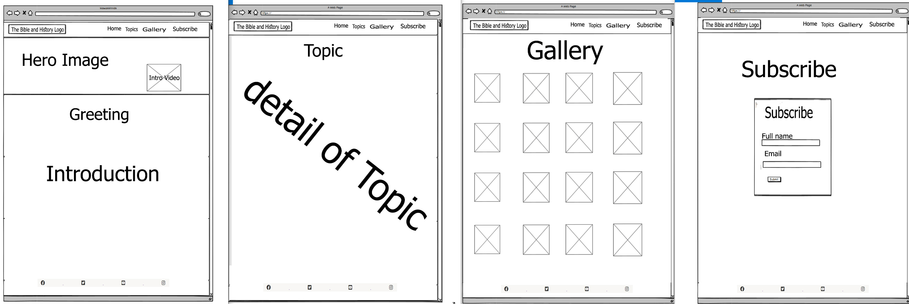

display on mobile devices

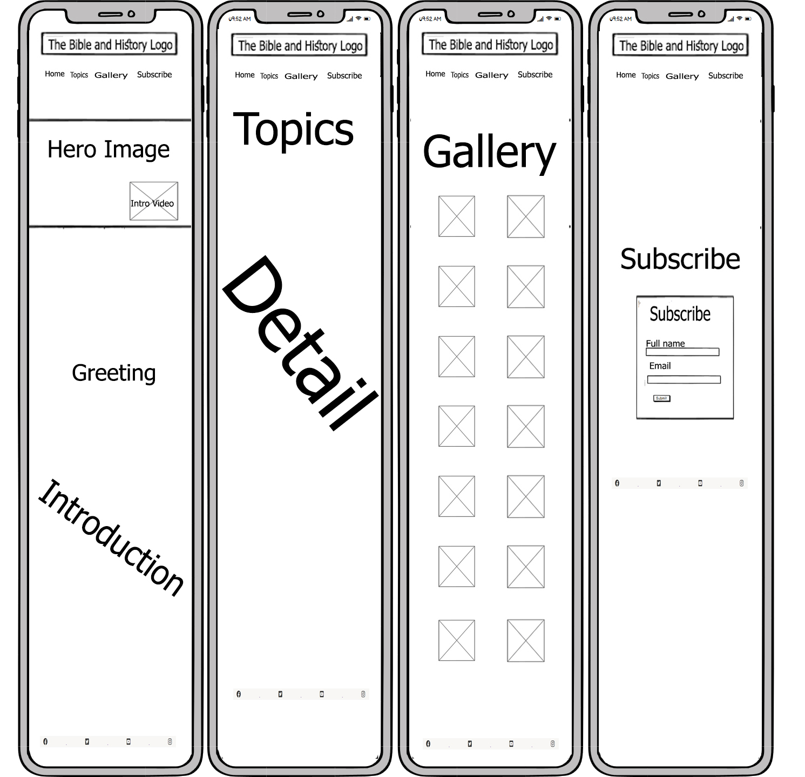

<h2>Site Structure</h2>

Website has four pages. the home page is the default loading page, topics, gallery and subscribe pages are all accessible primarily form the navigation menu. and user can subscribe to get latest news feed.

<h1>Design Choices</h1>

<h2>Typography</h2>

only 2 fonts were chosen for different parts to keep website simple. and so that reader might not have any problem on focusing writings.
<ul>
<li>"Tangerine cursive" is been used for website logo</li>
<li>"EB Garamond sans-serif" for greetings.</li>
</ul>

<h2>Colour scheme</h2>
#000
#8f7cec
#1095c1
#0a0303
#131212
#3a3a3a
#f8f7f5
#fff
#cbbddb
#242026
transparent
rgba(143, 124, 236, 0.7)

<h1>Features</h1>

The website is set up to be welcoming and seasy to use. it contains many features which are very easy to understand and use. such as for gallery, topics or subscribe user can get access throught navigation tools which are on right top of web page.

<h1>Navigation</h1>

<ul>
<li>Sited at the top of all the pages in the site, it is fully responsive and contains links to all the pages of the site to enable ease of navigation in one convenient location.</li>
<li>The logo is clickable with a link back to the home page for enhanced UX.</li>
</ul>
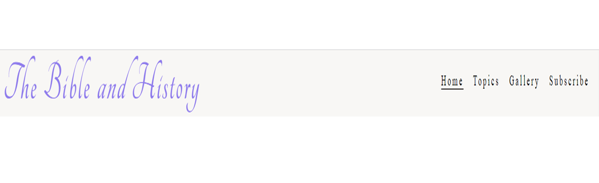

<h1>Gallery</h1>
<ul>
<li>located on navigation baar to make easy for user to get quick access to all pictures.</li>
<li>A responsively styled grid of images of past projects to give the user an idea of what and how things, this web brings into light.</li>
</ul>

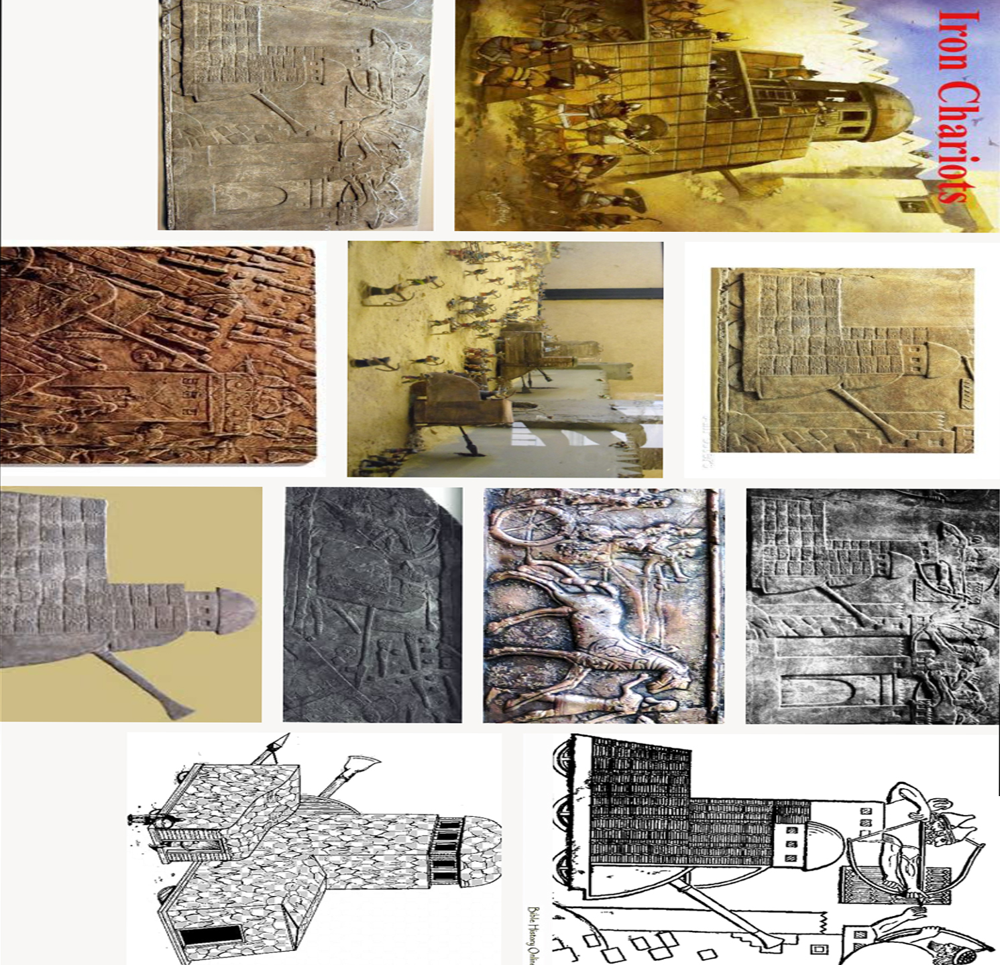

<h2>Footer</h2>
<ul>
<li>Contains social media links. To enhance the UX the links open in other tabs.</li>
<li>The social media presence will help the user with their research into The Bible and History and will also encourage them to connect with The Bible and History.</li>
<li>To help the user with navigation on all devices a 'scroll to the top' arrow was added. It sticks to the bottom left of the screen at all times to give the user a quick and unobstructed way to the navigation bar.</li>
</ul>

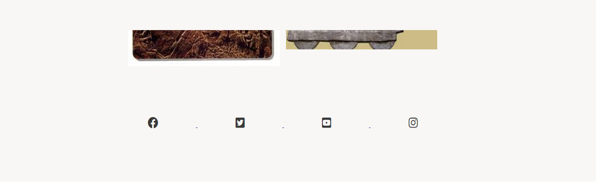

<h2>Topics</h2>

the topics page take user to the page where they can find different topics. and each topic have their own tag. user can simply click on tag and can gather information about topic. same way user can get images also by clicking on Gallery.

<h2>Subscribe</h2>

there is Subscribe option in the web site to which user can get access through navigation. and by subscribing to the web user can get News Feed.

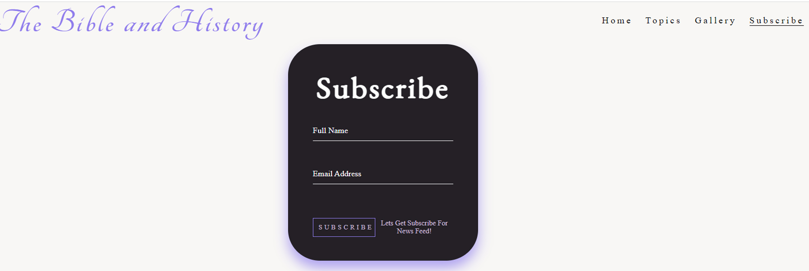

<h2>Future features</h2>

currently we are working on more topics and they will also be soon available for user to get information from. and as well as will upload more pictures regarding other topics also.

<h2>Technologies Used</h2>
<ul>
<li>HTML5- provides the content and structure for the website.</li>
<li>CSS- provides the styling.</li>
<li>PhotoShop- provides the styling.</li>
<li>Gitpod - used to deploy the website.</li>
<li>Github - used to host and edit the website.</li>
</ul>

<h1>Deployment</h1>

<h3>To deploy the project</h3>

The site was deployed to GitHub pages. The steps to deploy a site are as follows:

<ol>
<li>In the GitHub repository, navigate to the Settings tab.</li>
<li>Once in Settings, navigate to the Pages tab on the left hand side.</li>
<li>Under Source, select the branch to master, then click save.</li>
<li>Once the master branch has been selected, the page will be automatically refreshed with a detailed ribbon display to indicate the successful deployment.</li>
</ol>

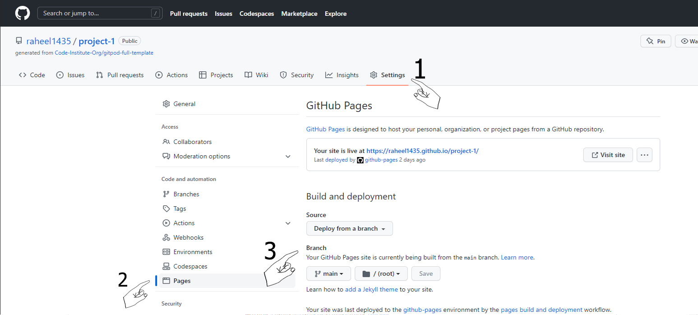

The live link to the Github repository can be found here - https://github.com/raheel1435/project-1/settings/pages

<h2>To fork the repository on GitHub</h2>

A copy of the GitHub Repository can be made by forking the GitHub account. This copy can be viewed and changes can be made to the copy without affecting the original repository. Take the following steps to fork the repository;

<ol>
<li>Log in to GitHub and locate the repository.</li>
<li>On the right hand side of the page inline with the repository name is a button called 'Fork', click on the button to create a copy of the original repository in your GitHub Account.</li>
</ol>

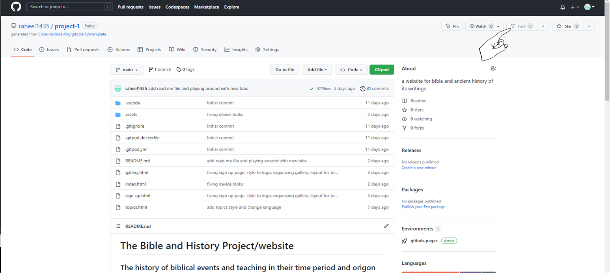

<h2>To create a local clone of this project</h2>

The method from cloning a project from GitHub is below:

<ol>
<li>Under the repository’s name, click on the code tab.</li>
<li>In the Clone with HTTPS section, click on the clipboard icon to copy the given URL.
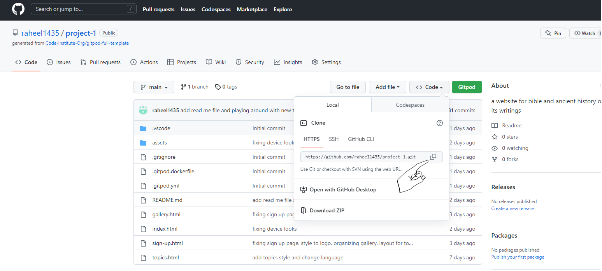</li>
<li>In your IDE of choice, open Git Bash.</li>
<li>Change the current working directory to the location where you want the cloned directory to be made.</li>
<li>Type git clone, and then paste the URL copied from GitHub.</li>
<li>Press enter and the local clone will be created.</li>
</ol>

<h1>Credits</h1>

<h2>Content</h2>
<ul>
<li>The font came from Google Fonts.</li>
<li>The icons came from Font Awesome.</li>
<li>The inspiration for the Project page sliders came from this repository on GitHub.</li>
<li></li>
</ul>

<h2>Testing</h2>

<h3>Code Validation</h3>

The Bible and History site has be throughly tested. All the code has been run through the W3C html Validator and the W3C CSS Validator. Minor errors were found on the home and inspiration pages. After a fix and retest, no errors were returned for both.

The HTML validator results for each page are below:

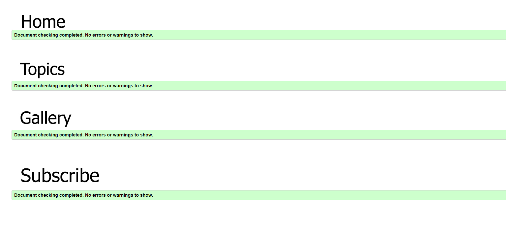

<h2>Responsive Test</h2>
<ul>
<li>The responsive design tests were carried out manually with Google Chrome DevTools and Responsive Design Checker.</li>
</ul>
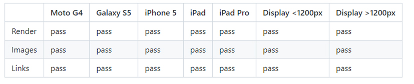

<h2>Known Bugs</h2>

there is an error which is based on main google font. thing it is asking are already on place. but still error is there. and still trying to figure out to solve it.

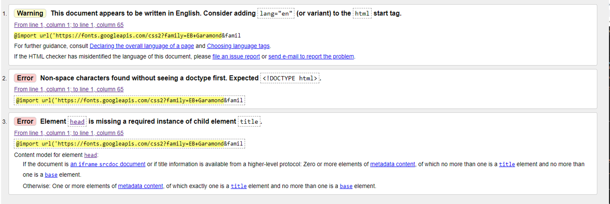

<h1>Acknowledgements</h1>

The site was completed as a Portfolio 1 Project piece for the Full Stack Software Developer (e-Commerce) Diploma at the Code Institute. As such I would like to thank my mentor Precious Ijege, the Slack community, and all at the Code Institute for their help and support. 

Raheel Shan 2022.

